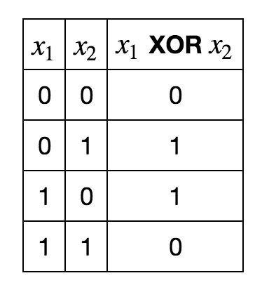
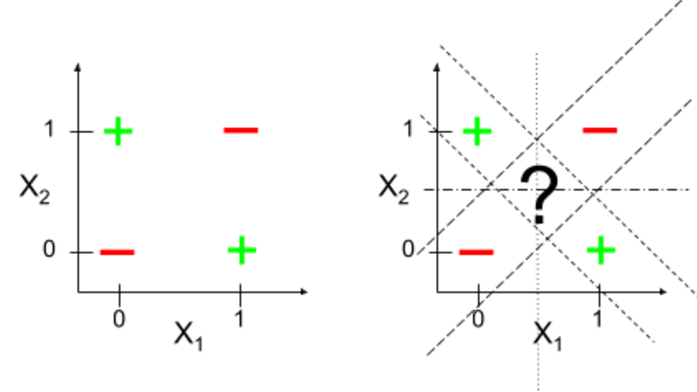
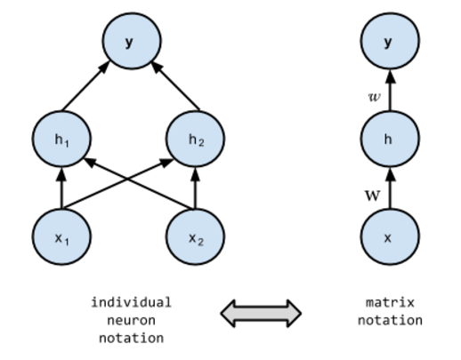
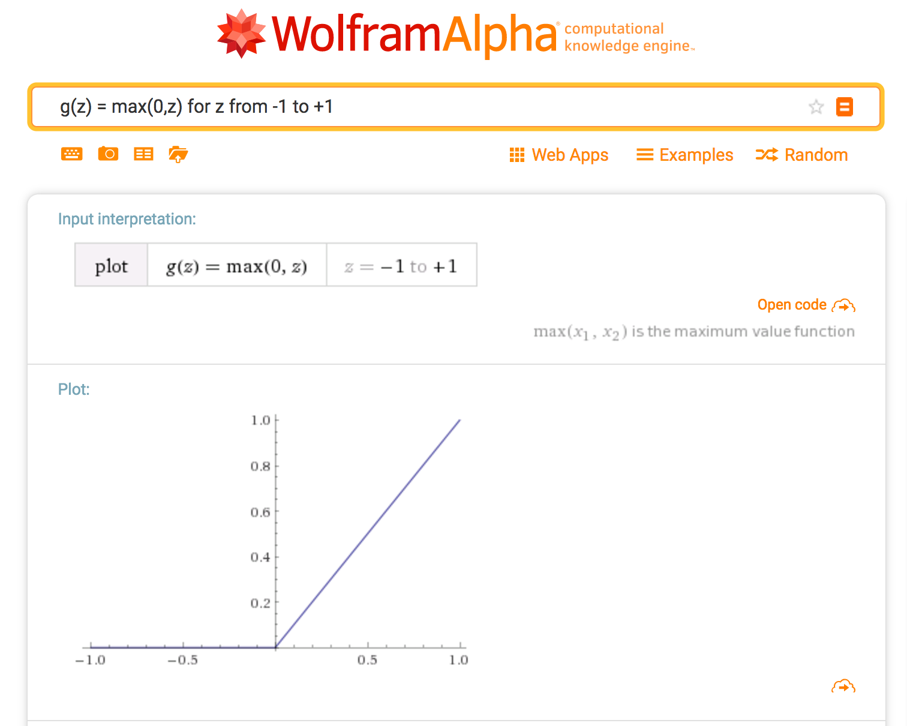

# Learning XOR with TensorFlow
## From the GBC Book or the Deep Learning Book
### by Claude COULOMBE - TÉLUQ / UQAM - Montréal

### Introduction

I've studied Machine Learning and Representation Learning which became «Deep Learning», attending Yoshua Bengio's courses in the late 2000s at Université de Montréal (UdeM). Recently, I decided to refresh my knowledge with the «Deep Learning» book published by MIT Press in 2016, featuring two UdeM professors and a brilliant PhD student, Ian GoodFellow who is now at Google. I shall refer to this book as the GBC  (Goodfellow, Bengio, Courville) book.  

The GBC book is worth the reading. It's definitely THE authoritative reference on Deep Learning but you should not be allergic to maths. 

That said, the main weakness of this masterpiece is the lack of practical programming exercices left to a companion web site. But to cover all the practical stuff, the book should have exceeded 775 pages that it already has. Furthermore reinforcement learning is superficially exposed in the GBC book which is due for an additional chapter. [Note]

I dream of he same content in the form of a series of iPython Notebooks with all exercices and code samples using Keras, TensorFlow and Theano.

So now, I commit a modest contribution to my dream by coding the 6.1 Example: Learning XOR pp. 166 to 171, using TensorFlow. Ok, I know I should have used Theano which is mainly developed and maintained by the MILA lab at UdeM... maybe later.

[Goodfellow, Bengio, Courville, 2016] Goodfellow, I., Bengio, Y., & Courville, A. (2016). Deep learning. MIT Press. On line at: http://www.deeplearningbook.org/

[Note] To be completely honest the authors wrote a short disclaimer in the «Machine Learning Basics» chapter 5, page 103 about reinforcement learning. « Such algorithms are beyond the scope of this book ».

## 6.1 Example: Learning XOR - GBC Book - Chapter 6 - pp. 166 to 171

### The XOR problem

In order to make the idea of a feedforward network (or multilayer perceptron) more concrete, in chapter 6 (Deep Feedforward Networks) the GBC book suggests a small example of a fully functioning feedforward network on a very simple task: learning the XOR (“exclusive or”) function. Below, the XOR Truth Table:

Nobody should get too excited, this is NOT a deep neural network example. It's quite the contrary, but it's an instructive illustration of a simple problem that requires a three layers perceptron (with a so-called "hidden" or "intermediary" layer) also known as one "hidden layer" perceptron. It also needs nonlinear functions called activation functions. 

The problem with XOR is that its outputs are not linearly separable. No unique straight line is able to separe the positive from the negative examples. 

### The Minsky-Papert controversy on XOR
At the same time there is probably historical reason behind this precise example in the GBC book. It was at the origin of the Minsky-Papert controversy on XOR. According to legend, research on neural networks have experienced a first pause after the publication in 1969 of a book on perceptrons by Marvin Minsky (who died January 24 2016) and Seymour Papert (who died July 31 the same year), that would have put emphasis on that limitation of perceptron. 

But the reality is much more nuanced (https://goo.gl/HZglx7). In 1969, it was already widely known that networks of neurons with linear and nonlinear functions can compute any possible boolean function. Furthermore, at that time, the backtracking algorithm was not invented yet and nobody knew how to train hidden layer of neurons.  

### One hidden layer Neural Network can learn XOR

<u>That said, we will show now that a neural network with one hidden layer and the backpropagation algorithm can learn XOR.</u> 

Below the architecture of our shallow (not deep at all!) feedforward neural network which contains 5 neurons or units distributed on 3 layers: an input layer which contains two neurons (or units), a single hidden layer containing 2 neurons and the output layer with 1 neuron. 

The left part of the above figure shows a detailed representation of the neural network, neuron by neuron with all the connections (except the biases). Good for small NNs this notation can be too cumbersome for larger networks. At right, the neural network is presented by layers in a more compact notation with weights represented by matrix (W and w).

### A bit of math behind
Here, the XOR function is the target function y=f*(x) that we want to learn. The model provides a function y=f(x;&Theta;) and backpropagation, our learning algorithm, will adapt the parameters &Theta; to make f as similar as possible to f*.

In this simple example, we want the neural network to perform correctly on only the four points X = { [0,0]T, [0,1]T, [1,0]T, [1,1]T } of the XOR truth table. In order to do so, we will train the neural network on all four of these points. The only challenge is to fit the training set.

The architecture of the neural network is a very simple feedforward network which involves three layers. The first layer is a simple input layer x which is fed to the second layer that is one single layer of hidden units h computed by a function f(1)(x;W,c). The values of these hidden units are the input for a third layer which is the output layer of the network. The output layer is a linear regression model applied to h. Thus, the network involves two functions chained together: h=f(1)(x;W,c) and y=f(2)(h;w,b). The complete model is f(x;W,c,w,b) = f(2)(f(1)(x)).

What does the function f(1) compute? We cannot take linear models since if f(1) is linear, then the entire neural network would remain a linear function of its input. Ignoring biases, f(1) =WTx and f(2)(h) = hTw, then f(x) = wTWTx also expressed by f(x) = xTw' where w'= Ww

So, we must use a nonlinear function. Most neural networks used an affine function (linear function followed by a translation like f(x) = ax+b) defined by their learned parameters (a,b), followed by a nonlinear function called the 'activation' function. Since we have an affine function from a vector x to a vector h, then an entire matrix vector W of weights and a vector c of bias parameters are needed. Thus, we define h=g(WTx+c), where W are the weights of an affine function and c the biases. 

The activation function g is applied element-wise, with hi = g(xTW:,i+ci). The state-of-the-art recommendation for the activation function is to use the rectified linear unitor ReLU (Jarrett et al., 2009; Nair and Hinton, 2010; Glorot et al., 2011a) defined by the function g(z) = max{0,z} shown below. Strangely, this function is neither continous nor derivable at z=0. 

Mathematically, the complete network is:

f(x;W,c,w,b)=wTmax{0,WTx+c}+b

### The loss function

Now that we have our model, it's time to choose a loss function. We will treat this problem as a regression and use a mean squared error loss function (MSE).

Mathematically our MSE loss function is:

J(&Theta;) = 1/4 &Sigma;{x &epsilon; X}(f*(x)-f(x;&Theta;))2
  

We have also added a sigmoid function at the output layer as recommended for the prediction of a binary variable in the section 6.2.2.2 of the GBC book. 

ÿ = &sigma;(wT max{0,WTx+c}+b)

### TensorFlow implementation

Now it's time to move on and implement the XOR network in TensorFlow. I've been inspired by the blog post <a href="https://aimatters.wordpress.com/2016/01/16/solving-xor-with-a-neural-network-in-tensorflow/">"Solving XOR with a Neural Network in TensorFlow"</a> by Stephen OMAN and the <a href="https://github.com/StephenOman/TensorFlowExamples/blob/master/xor%20nn/xor_nn.py">code</a> in his GitHub repo. 

I also proposed different loss functions that I've commented in my code below. 

First, a naive direct implementation of the loss function as shown in the GBC book.

`n_instances = X.get_shape().as_list()[0]` 
`loss = tf.reduce_sum(tf.pow(y_estimated - Y, 2))/ n_instances`

Then the classical MSE function wich uses the TensorFlow `tf.reduce_mean` function that should take care of numerical stability issue as I read somewhere...       

`loss = tf.reduce_mean(tf.squared_difference(y_estimated, Y))` 

In case of problem with gradient (exploding or vanishing gradient) we could alternatively perform gradient clipping using the TensorFlow function `tf.clip_by_value(t, clip_value_min, clip_value_max)`. Any value less than clip_value_min will be set to clip_value_min. Any value greater than clip_value_max will be set to clip_value_max.

`loss = tf.reduce_sum(tf.pow(tf.clip_by_value(y_estimated,1e-10,1.0) - Y,2))/(n_instances)`

### Instructions

1) Check out this repository 
> git clone https://github.com/ClaudeCoulombe/GBC_book_DeepLearningBook.git

2) Start Jupyter iPython Notebook from the folder where the code ins installed 
> Jupyter Notebook

3) Execute the GBC_Book-Learning_XOR_In_TensorFlow.ipynb notebook

